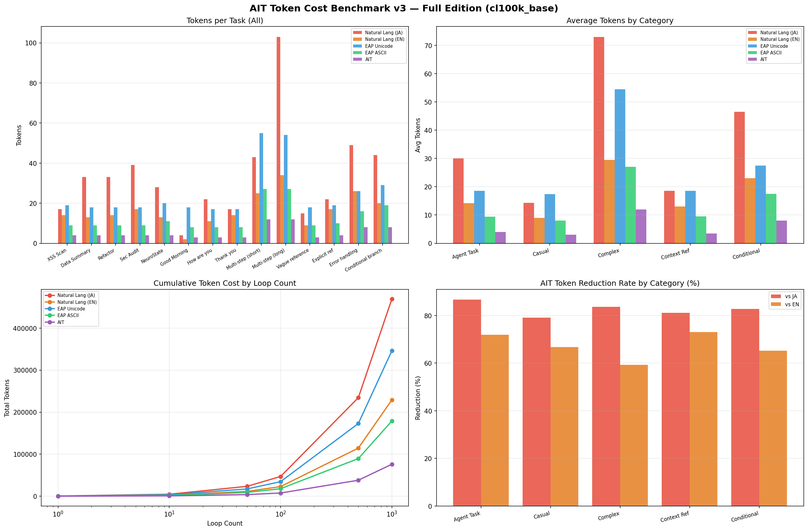

# AIT Token Cost Benchmark v3 — Full Edition

Tokenizer: **cl100k_base** (GPT-4 / Claude compatible)  
Tasks: **14** across 5 categories  
Formats compared: Natural Language (JA/EN), EAP Unicode, EAP ASCII, **AIT**

---

## Overall Results

| Format | Avg tokens/task | vs JA reduction |
|--------|---------------:|----------------:|
| Natural Lang (JA) | 33.5 | — |
| Natural Lang (EN) | 16.4 | 51.0% |
| EAP Unicode | 24.7 | 26.3% |
| EAP ASCII | 12.8 | 61.8% |
| **AIT** | **5.4** | **83.8%** |

**AIT cuts token cost by 83.8% vs Japanese natural language, and 66.8% vs English.**

---

## By Category

| Category | JA avg | EN avg | EAP-Unicode | EAP-ASCII | AIT | AIT vs JA |
|----------|-------:|-------:|------------:|----------:|----:|----------:|
| Agent Task | 30.0 | 14.2 | 18.6 | 9.4 | 4.0 | **86.7%** |
| Casual | 14.3 | 9.0 | 17.3 | 8.0 | 3.0 | **79.0%** |
| Complex | 73.0 | 29.5 | 54.5 | 27.0 | 12.0 | **83.6%** |
| Context Ref | 18.5 | 13.0 | 18.5 | 9.5 | 3.5 | **81.1%** |
| Conditional | 46.5 | 23.0 | 27.5 | 17.5 | 8.0 | **82.8%** |

Notable: EAP Unicode **costs more tokens than natural English** in most categories due to emoji/symbol fragmentation. AIT stays flat and minimal across all task types.

---

## Loop Cost Projection (all 14 tasks)

| Loop count | JA total | AIT total | Saved |
|-----------:|---------:|----------:|------:|
| 1 | 469 | 76 | 393 |
| 10 | 4,690 | 760 | 3,930 |
| 100 | 46,900 | 7,600 | 39,300 |
| 1,000 | 469,000 | 76,000 | **393,000** |

At 1,000 agentic loops, AIT saves ~393,000 tokens — roughly **40× fewer tokens** than Japanese prompts.

---

## Key Findings

1. **EAP Unicode is expensive** — emoji and special symbols often split into 2–4 tokens each with cl100k_base. Visual clarity comes at real cost.
2. **EAP ASCII is competitive** — beats English natural language in most cases (12.8 vs 16.4 avg).
3. **AIT is the floor** — fixed-position 4-char opcodes are nearly unbeatable for machine-to-machine traffic. Casual tasks cost just 3 tokens.
4. **Scaling matters** — the gap widens linearly. At agent loop scales (100–1000 iterations), AIT becomes the clear winner.

---

## Benchmark Chart



---

## Reproduction

```bash
pip install tiktoken pandas matplotlib numpy
python ait_benchmark_v3.py
```

Results are deterministic (tiktoken encoding is fixed for cl100k_base).

---

*Related: [Esoteric AI Protocol (EAP)](https://github.com/kagioneko/esoteric-ai-protocol) — the assembly-like layer above AIT.*
